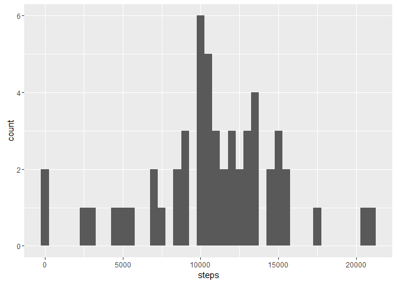
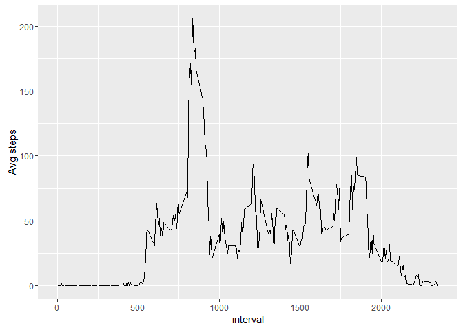
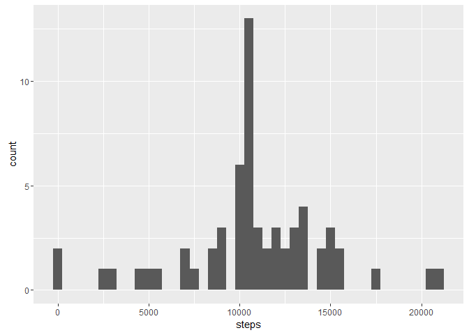
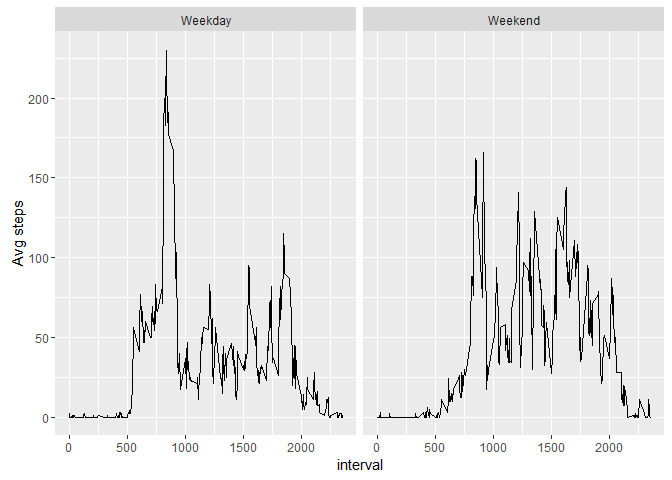

# Reproducible Research: Peer Assessment 1


## Loading and preprocessing the data
Load the activity data

```r
activityData<-read.csv("C:/Users/Jason Schmidt/Documents/coursera/data scientist/RepData_PeerAssessment1/activity.csv")
```

Summarise data into number of steps per day


```r
library(data.table)
```

```
## Warning: package 'data.table' was built under R version 3.2.5
```

```r
stepsPerDay<-data.table(activityData)
stepsPerDay<-stepsPerDay[,list(steps=sum(steps)),by=date]
```

Summarise the data into average steps per interval

```r
avgStepsPerInterval<-data.table(activityData)
avgStepsPerInterval<-avgStepsPerInterval[,list(steps=as.integer(mean(steps,na.rm = TRUE))),by=interval]
```

## What is mean total number of steps taken per day?
Plot a histogram depicting the spread of the number of steps taken each day

```r
library(ggplot2)
ggplot(stepsPerDay,aes(x=steps))+geom_histogram(na.rm=TRUE, binwidth = 500)
```

<!-- -->

Calculate the mean and median number of steps taken per day

```r
mean1<-as.integer(mean(stepsPerDay$steps, na.rm = TRUE))
median1<-median(stepsPerDay$steps, na.rm = TRUE)

mean1
```

```
## [1] 10766
```

```r
median1
```

```
## [1] 10765
```

## What is the average daily activity pattern?

Plot the average number of steps taken in an interval over all days

```r
ggplot(avgStepsPerInterval, aes(interval, steps)) + geom_line() + xlab("interval") + ylab("Avg steps")
```

<!-- -->

Interval containing the maximum average number of steps across all days:

```r
avgStepsPerInterval[steps==max(avgStepsPerInterval$steps)]
```

```
##    interval steps
## 1:      835   206
```

## Imputing missing values
Calculate the number of NA values in steps

```r
sum(is.na(activityData[,"steps"]))
```

```
## [1] 2304
```

Impute missing NA values by using the average value for the interval across all days

```r
setDT(activityData)
setkey(activityData,date,interval)
activityData[, stepsInterval:= as.integer(mean(steps, na.rm = TRUE)), by = interval]
activityData[is.na(steps),steps:=stepsInterval]
```

Summarise revised data into number of steps per day


```r
stepsPerDay<-data.table(activityData)
stepsPerDay<-stepsPerDay[,list(steps=sum(steps)),by=date]
```

Plot a histogram of revised data depicting the spread of the number of steps taken each day

```r
ggplot(stepsPerDay,aes(x=steps))+geom_histogram(na.rm=TRUE, binwidth = 500)
```

<!-- -->

Calculate the mean and median number of steps taken per day for the revised data set

```r
mean2<-as.integer(mean(stepsPerDay$steps, na.rm = TRUE))
median2<-median(stepsPerDay$steps, na.rm = TRUE)

mean2
```

```
## [1] 10749
```

```r
median2
```

```
## [1] 10641
```

The mean and median are lower than the previous estimates. Mean was 10766 now 10749; median was 10765 now 10641. Imputing values brings down the estimate of total number of steps per day.

## Are there differences in activity patterns between weekdays and weekends?

Create a new factor variable in the dataset with two levels - "weekday" and "weekend" indicating whether a given date is a weekday or weekend day.


```r
activityData[, weekday:= as.factor(weekdays(as.Date(activityData$date)))]
levels(activityData$weekday)<-list(Weekday=c("Monday","Tuesday","Wednesday","Thursday","Friday"),Weekend=c("Saturday","Sunday"))
```

Time series plot of the average number of steps taken, averaged across all weekday days or weekend days

```r
avgStepsPerInterval<-data.table(activityData)
avgStepsPerInterval<-avgStepsPerInterval[,list(steps=as.integer(mean(steps,na.rm = TRUE)),weekday=weekday),by=c("interval","weekday")]

ggplot(avgStepsPerInterval, aes(interval, steps)) + geom_line() + xlab("interval") + ylab("Avg steps")+facet_grid(.~weekday)
```

<!-- -->
